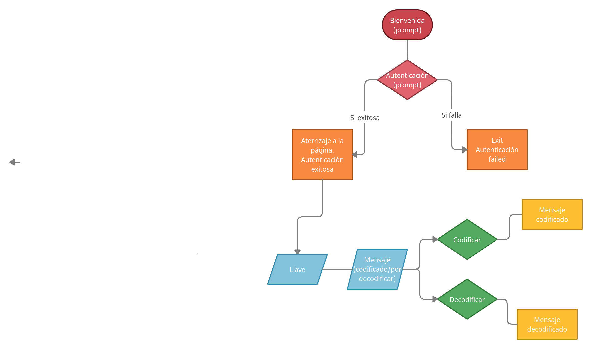
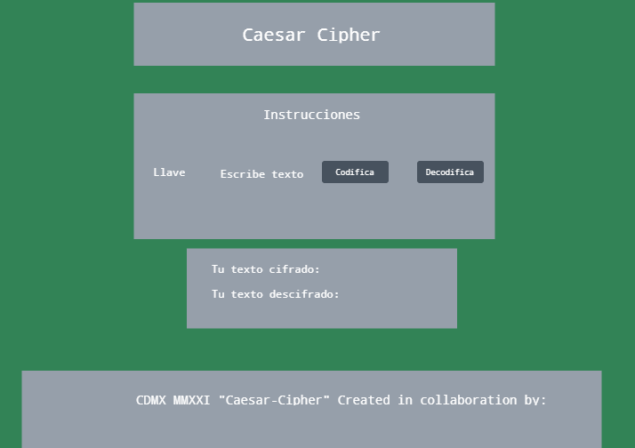

e## **Indice**

  1. Descripción
  2. Necesidades del cliente
  3. Criterio de aceptación
  4. Edición Hacker
  5. Diagrama de Flujo
  6. Diseño de Interfaz

---
## **1. Descripción**

Una aplicación que sirva para cifrar y descifrar mensajes, creada con html, css y javascript.

---
## **2. Necesidades del cliente**

1. El usuario quiere ocultar el significado de mensajes encriptados.
2. El usuario quiere compartir la aplicación con personas seleccionadas para poder describir los mensajes.
3. El usuario quiere cifrar y descifrar el mensaje con cadenas.

---
## **3. Criterios de aceptación**

Esta aplicación debe permitir al usuario cifrar mensajes y también permitir descifrar el mensaje. Debe ser receptivo y en una URL para compartirlo y usarse desde un teléfono celular a otra pantalla de dispositivo como un escritorio.

---
## **4. Edición Hacker**

Se suguiere que se cree también una función cipher.createCipherWithOffset () que recibe un desplazamiento y devuelve un nuevo objeto con dos métodos (codificar y decodificar) que solo reciben la cadena y utilizan el desplazamiento que se pasó a createCipherWithOffset en el momento de crear el objeto.

---

## **5. Diagrama de flujo**

---
## **6. Diseño de Interfaz**

